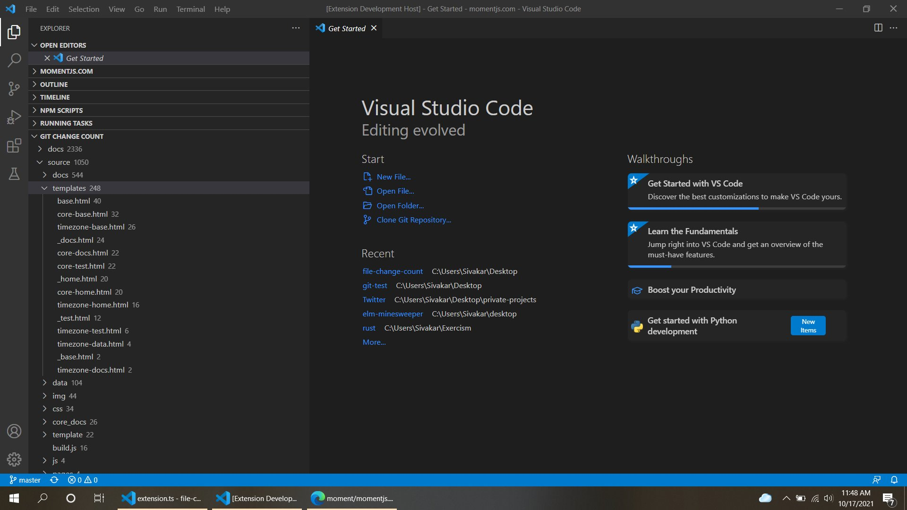

# File Change Count - VS Code Extension

An extension to see how many times a file is changed in across the Git commits. I think it is a heuristic to see what are the important files in a repository.

